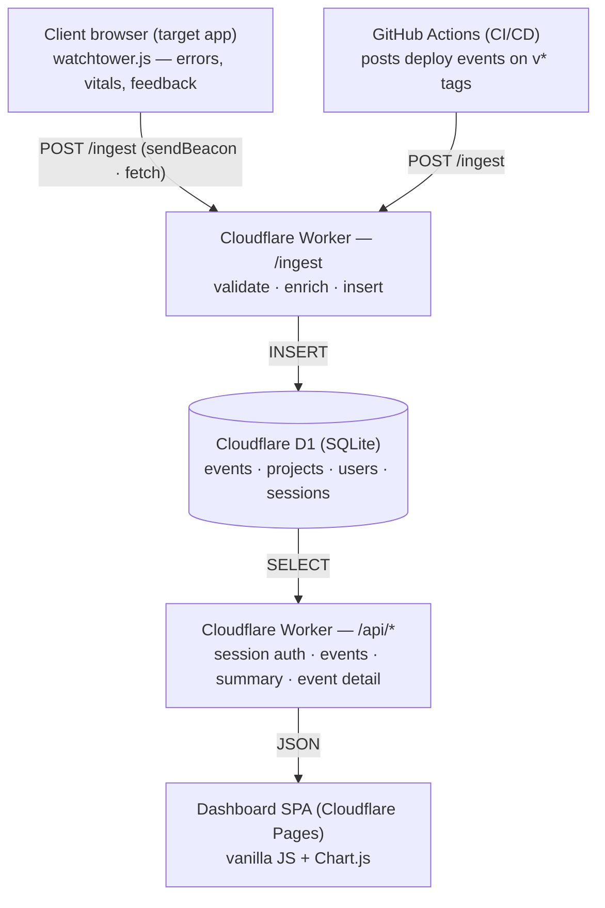

# WatchTower — Architecture Overview

> Centralized observability for early-stage teams. Captures errors, performance signals, and user feedback from any instrumented web app, and correlates them with deployment events from CI.

## 1. Purpose

WatchTower exists to answer one question well: **"Which deployment started the fire?"**

Three signal sources flow into one place:
- Runtime errors and unhandled rejections from a monitored web app.
- Core Web Vitals (LCP, INP, CLS) and page-load timing.
- User-supplied feedback (rating widget + short text).

These are correlated with deploy events from GitHub Actions so the team can spot when a regression landed.

This document describes the architecture chosen to deliver a working MVP in **three weeks** under the CSE 110 project constraints — vanilla JS only on the client, Cloudflare or GitHub Pages for any server-side, no third-party frameworks, and process discipline (ADRs, CI, PR review on batches >300 LoC).

## 2. Architecture Diagram

The system is a five-layer vertical pipeline. Two distinct sources (the client SDK and GitHub Actions) both feed a single ingestion endpoint. Events are persisted in a relational store and read back through a separate API for the dashboard.

## 3. Components

### 3.1 Client SDK — `watchtower.js`

A single, dependency-free JavaScript file (~5 KB minified) included by any app the team wants to monitor.

- Hooks `window.onerror` and `unhandledrejection` to capture runtime errors with stack traces.
- Uses `PerformanceObserver` to capture Core Web Vitals (LCP, INP, CLS) and basic navigation timing.
- Renders an opt-in feedback widget (star rating + short text) that the host app can show on demand.
- Batches events in memory and flushes via `navigator.sendBeacon` on page unload, falling back to `fetch` with `keepalive: true` for in-session sends.
- Authenticates with a public project API key embedded at script load time.

### 3.2 Ingest Worker — Cloudflare Worker at `/ingest`

A single Worker route that accepts JSON payloads from both the client SDK and CI. Three steps, fail-fast, stateless:

1. **Validate** — checks the envelope shape (`{ project_id, events[] }`), caps the batch size, and rejects unknown `project_id` with 401.
2. **Enrich** — adds a server-side `received_at` timestamp, the `User-Agent` header on browser events, and country from the `cf-ipcountry` header.
3. **Insert** — writes the batch to D1 in one all-or-nothing `batch()` of prepared statements.

Returns 204 on success so clients don't waste bandwidth on response bodies.

### 3.3 Storage — Cloudflare D1

D1 is Cloudflare's managed SQLite. The free tier comfortably covers a class project. Four tables:

| Table | Purpose |
|---|---|
| `projects` | One row per monitored app. `project_id` is the public key clients send; `owner_id` gates dashboard access. |
| `events` | Polymorphic table for errors, performance samples, feedback, pageviews, and deploy markers. An `event_type` column discriminates; payload-specific fields live in a JSON column. |
| `users` | Dashboard accounts (email, hashed password). Seeded; no self-serve signup. |
| `sessions` | Server-side session rows backing the signed auth cookie. |

Collapsing all event types (deploys included) into one `events` table is a deliberate scope reduction (ADR-0004). It removes triplicate CRUD code at the cost of slightly larger rows.

### 3.4 Reporting API — Cloudflare Worker at `/api/*`

A second Worker, deployed separately from ingest (ADR-0009), that serves the dashboard.

- `POST /api/login` — verifies seeded credentials, issues a signed session cookie, returns the user and their projects.
- `POST /api/logout` — revokes the session row and clears the cookie.
- `GET /api/events?type=error&since=...` — filtered event listing with pagination. Deploys are listed via `?type=deploy`; there is no separate deploys endpoint.
- `GET /api/events/:event_id` — full event detail plus `correlated_deploy`, the nearest deploy at-or-before the event in the same project.
- `GET /api/summary` — pre-aggregated totals, timeseries, and site status for the overview screen.

Every `/api/*` request requires the signed session cookie plus the `X-Watchtower-Auth` header (CSRF defense), and CORS is pinned to the dashboard origin (ADR-0005). Project access is ownership-gated: unknown `project_id` returns 404, someone else's returns 403. No OAuth, no external auth provider.

### 3.5 Dashboard — Cloudflare Pages

A static single-page app:

- Vanilla JS, no framework, hash-based routing (`#/overview`, `#/errors`, `#/perf`, `#/feedback`, `#/deploys`).
- Chart.js loaded from cdnjs for graphs (line charts for performance trends, bar charts for error frequency).
- Plain CSS, no preprocessor.
- Deployed to Cloudflare Pages on every push to `main`.

### 3.6 CI/CD — GitHub Actions

- **On every PR**: ESLint, unit tests, e2e tests (Playwright headless), build check.
- **On every `v*` tag**: deploy Workers via `wrangler deploy` (ADR-0010); the dashboard deploys via Cloudflare Pages on push to `main`.
- **Post-deploy**: the tag workflow POSTs a deploy event to `/ingest` (commit SHA as `deploy_id`) so WatchTower observes its own deploys (free dogfooding for demos).

## 4. End-to-End Data Flow

A typical flow on the error path:

1. A user clicks something in a monitored app and the JS throws.
2. `watchtower.js`'s error handler captures the stack trace, batches it, and within ~5 s fires `navigator.sendBeacon('/ingest', payload)`.
3. The Ingest Worker validates the `project_id`, enriches the payload with country and timestamp, and `INSERT`s into the `events` table.
4. A team member logs into the dashboard. The SPA calls `GET /api/events?type=error&since=24h` with the session cookie.
5. The Reporting Worker checks the session and project ownership, queries D1, and returns JSON.
6. The dashboard renders the error in a sortable table. Clicking it calls `GET /api/events/:event_id`, whose `correlated_deploy` field carries the nearest deploy at-or-before the error, surfacing the likely culprit.

## 5. Why This Stack

**Constraint match.** The course rules permit only vanilla JS/HTML/CSS on the client and Cloudflare or GitHub Pages on the server. Cloudflare Workers + D1 + Pages is the simplest combination that satisfies all three with one vendor and one CLI (`wrangler`).

**Three-week realism.** Every layer is chosen so one person can stand it up in a day:

- D1 needs no DB admin or local server — `wrangler d1 create` and you're done.
- Workers deploy in seconds and have generous free-tier limits.
- The dashboard has no build step (vanilla JS + CDN).
- Auth is a signed cookie, not OAuth.

**Process over product.** The architecture is deliberately small to leave time for the Agile process the project rubric weights heavily — sprint planning, retros, ADRs, CI checks, and code review on PRs over 300 LoC. A repeatable process producing a smaller working product scores higher than a feature-rich one done opaquely.

## 6. Trade-offs and Known Limits

- **No multi-region replication.** D1 has a single primary; cross-region reads are eventually consistent. Acceptable for a class demo.
- **No queueing on ingest.** A spike in events can drop writes if D1 throttles. WatchTower is operational-facing software, so we explicitly accept this and document it rather than building a queue.
- **Polymorphic `events` table** trades schema clarity for development speed. Splittable later if event volume grows.
- **No PII redaction in errors.** Stack traces may include user input. Scope adds only a coarse "scrub query strings" toggle.

## 7. Architectural Decision Records

Each major decision above is captured as a separate MADR file under `docs/adr/`. The ones most relevant here: ADR-0002 (D1), ADR-0004 (single events table), ADR-0005 (signed-cookie auth), ADR-0009 (two-worker split), ADR-0010 (tag-based deploys).

## 8. Out of Scope for the MVP

The following are deliberately deferred and noted here so future maintainers don't mistake their absence for an oversight:

- Source-map upload and stack-trace symbolication.
- Alerting (Slack, email, PagerDuty).
- Long-term retention beyond 30 days.
- Multi-tenant isolation beyond the project API key.
- Native mobile SDKs.

