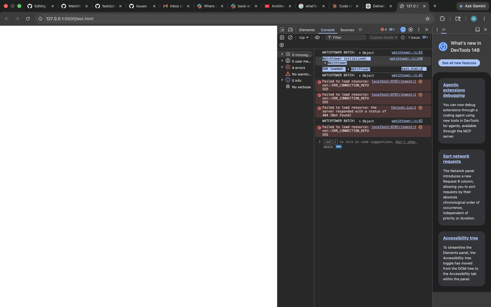

# Integration
## How to Embed
1. Add the Watchtower SDK to your html file with the following script tag
```
<script src = "https://cdn.jsdelivr.net/..."></script> 
```
3. Add this to your applications code
```
function init() {
  const wt = new WatchTower({ projectId: "wt_a1b2c3d4" })
  wt.init()
}
```
3. After setting up, you should see the following console logs in your web application if successful
  - Watchtower initialized: Watchtower
  - SDK loaded: Watchtower

  
***
## How to Test
1. Add a test button to manually trigger an error
```
<button id="trigger-error">Trigger Test Error</button>

<script>
  document
    .getElementById("trigger-error")
    .addEventListener("click", () => {
      // Simulate a runtime error
      throw new Error("Manual test error triggered");
    });
</script>
```
   
***
